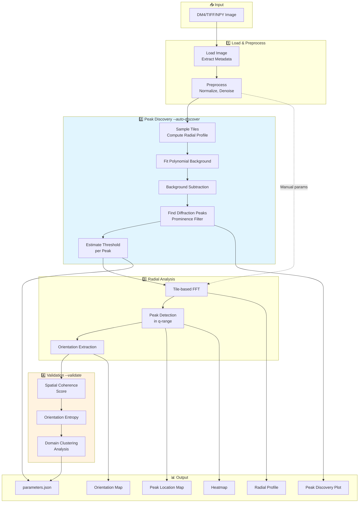
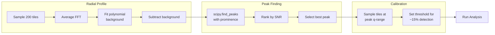

# STEM Domain Analysis

Automated crystal domain segmentation and orientation mapping for STEM-HAADF (Scanning Transmission Electron Microscopy - High-Angle Annular Dark-Field) images.

## Overview

This toolkit processes large-scale STEM images to:
- **Detect crystalline domains** via FFT-based radial profile analysis
- **Automatically discover diffraction peaks** without prior material knowledge
- **Map crystal orientations** using diffraction peak localization
- **Validate results** with spatial coherence analysis
- **Generate quantitative metrics** for domain size, shape, and orientation distributions

## Pipeline Architecture



## What's New (v2.0)

### 🎨 E1: Enhanced Output & Presentation
- **Original image preserved** — `0_Original.png` saved before any processing
- **Scale bars** on all output images (using matplotlib-scalebar)
- **Smart folder naming** — Output folder named after input file (`outputs/<filename>/`)

### 🎚️ E2: Interactive Threshold Tuning
- **`--interactive-threshold`** — Iteratively adjust threshold until satisfied
- Visual feedback with detection rate guidance (too low/high/reasonable)
- Iteration count tracked in `parameters.json`

### 📊 E3: Robust Peak Detection
- **`--peak-method percentile95`** (new default) — Uses mean of top 5% intensities
- More robust for polycrystalline samples with diffuse ring patterns
- Weighted centroid for accurate peak localization
- Legacy mode: `--peak-method max` for single-pixel maximum

### 🌈 E4: Multi-Plane Discrimination
- **`--multi-plane`** — Analyze multiple lattice planes simultaneously
- **`--interactive`** — Select which discovered peaks to analyze
- **`--max-planes N`** — Limit number of planes (default: 5)
- Color-coded composite maps showing dominant plane per region
- Per-plane orientation maps (`5a_Orientation_Plane0.png`, `5b_...`, etc.)

---

## Features

- 🔍 **Automatic Peak Discovery** — Finds crystalline diffraction peaks without requiring d-spacing input
- 📊 **Background-Subtracted Radial Profile** — Reveals true peaks above noise floor
- 🎯 **Adaptive Threshold Calibration** — Sets threshold based on actual peak intensity
- ✅ **Spatial Coherence Validation** — Detects when results are noise vs. real domains
- 🗺️ **Orientation Mapping** — Color-coded visualization of crystal orientations
- 📐 **Domain Metrics** — Area, perimeter, circularity, orientation statistics
- 🔬 **DM4 Support** — Native reading of Gatan Digital Micrograph files
- 🎨 **Scale Bars** — Calibrated scale bars on all output images
- 🌈 **Multi-Plane Analysis** — Simultaneous analysis of multiple lattice planes

## Installation

### Requirements

- Python 3.10+
- NumPy, SciPy, scikit-image, scikit-learn
- Matplotlib, matplotlib-scalebar
- HyperSpy, ncempy (for DM4 file reading)

### Setup

```bash
# Clone the repository
git clone https://github.com/YishaiRetyk/stem-domain-analysis.git
cd stem-domain-analysis

# Create virtual environment
python -m venv .venv
source .venv/bin/activate  # Linux/Mac
# or: .venv\Scripts\activate  # Windows

# Install dependencies
pip install -r requirements.txt
```

## Quick Start

### 🚀 Automatic Mode (Recommended)

**Don't know the d-spacing? Use `--auto-discover`:**

```bash
# Auto-discover peaks and validate results
python analyze.py sample.dm4 --auto-discover --validate

# Non-interactive (for scripts/automation)
python analyze.py sample.dm4 --auto-discover --validate --no-interactive -o results/
```

The auto-discovery will:
1. Compute background-subtracted radial profile
2. Find diffraction peaks using prominence detection
3. Recommend optimal d-spacing range and threshold
4. Validate results for spatial coherence

### Manual Mode

If you know the material's d-spacing:

```bash
# Specify parameters directly
python analyze.py sample.dm4 \
    --d-min 0.39 \
    --d-max 0.43 \
    --threshold 45000 \
    -o results/

# Interactive mode - prompts for missing parameters
python analyze.py sample.dm4
```

### Full CLI Reference

```bash
python analyze.py <input> [options]

Positional:
  input                   Input file (DM4, DM3, TIFF, or NPY)

Core Options:
  -o, --output DIR        Output directory (default: outputs/<input_filename>/)
  --pixel-size FLOAT      Pixel size in nm/pixel (auto-detected from DM4)
  --d-min FLOAT           Minimum d-spacing in nm
  --d-max FLOAT           Maximum d-spacing in nm
  --threshold FLOAT       Peak detection intensity threshold
  --tile-size INT         FFT tile size in pixels (default: 256)
  --stride INT            Tile stride in pixels (default: tile_size/2)
  --auto-discover         Automatically discover diffraction peaks
  --validate              Validate results with coherence analysis
  --no-interactive        Fail instead of prompting for missing params
  --save-preprocessed     Save preprocessed image as NPY
  -v, --verbose           Verbose output

Peak Detection (E3):
  --peak-method {max,percentile95}
                          Peak intensity method (default: percentile95)
                          - max: Single brightest pixel
                          - percentile95: Mean of top 5% (more robust)

Interactive Threshold (E2):
  --interactive-threshold
                          Enable iterative threshold adjustment
                          Shows results, allows tweaking until satisfied

Multi-Plane Analysis (E4):
  --multi-plane           Analyze all discovered peaks simultaneously
                          (requires --auto-discover)
  --interactive           Interactive mode: select which peaks to analyze
  --max-planes N          Maximum planes to analyze (default: 5)
```

### Usage Examples

```bash
# Basic auto-discovery (recommended)
python analyze.py sample.dm4 --auto-discover

# With interactive threshold tuning
python analyze.py sample.dm4 --auto-discover --interactive-threshold

# Multi-plane analysis (all discovered peaks)
python analyze.py sample.dm4 --auto-discover --multi-plane

# Interactive plane selection
python analyze.py sample.dm4 --auto-discover --multi-plane --interactive

# Combine features
python analyze.py sample.dm4 --auto-discover --multi-plane --interactive-threshold

# Non-interactive batch mode
python analyze.py *.dm4 --auto-discover --no-interactive
```

## Output Files

Output is saved to `outputs/<input_filename>/` by default.

| File | Description |
|------|-------------|
| `0_Original.png` | **NEW:** Original image before processing (with scale bar) |
| `original.npy` | **NEW:** Original image data (NumPy format) |
| `1_Peak_Discovery.png` | Background-subtracted radial profile with detected peaks *(auto-discover only)* |
| `2_Radial_Profile.png` | FFT radial intensity profile with highlighted q-range |
| `3_FFT_Power_Spectrum.png` | 2D FFT power spectrum visualization |
| `4_Peak_Location_Map.png` | Spatial map of detected crystalline peaks (green overlay, with scale bar) |
| `5_Orientation_Map.png` | Color-coded crystal orientation map (-180° to +180°, with scale bar) |
| `5a_Orientation_Plane0.png` | **NEW:** Per-plane orientation map *(multi-plane mode only)* |
| `5b_Orientation_Plane1.png` | **NEW:** Per-plane orientation map *(multi-plane mode only)* |
| `6_Multi_Plane_Composite.png` | **NEW:** Color-coded composite showing dominant plane per region *(multi-plane mode only)* |
| `Heatmap.png` | Peak intensity heatmap across tile grid |
| `parameters.json` | All analysis parameters, validation results, and plane metadata |

## How Auto-Discovery Works

The `--auto-discover` flag enables automatic parameter selection:



### Why Background Subtraction?

Raw FFT profiles show a strong power-law decay that masks diffraction peaks:

| Without Background Subtraction | With Background Subtraction |
|-------------------------------|----------------------------|
| Monotonic decay | Clear peaks visible |
| Peaks hidden in noise | SNR quantifiable |
| Manual d-spacing required | Automatic peak finding |

## Validation Metrics

When using `--validate`, the tool computes:

| Metric | Good Value | Meaning |
|--------|------------|---------|
| **Coherence Score** | > 0.5 | Combined spatial + orientation coherence |
| **Local Coherence** | > 0.5 | Neighboring tiles have similar orientations |
| **Orientation Entropy** | < 0.5 | Orientations cluster (not random) |
| **Detection Rate** | 5-30% | Reasonable crystalline fraction |

### Interpreting Results

| Interpretation | What It Means | Action |
|----------------|---------------|--------|
| `good_domains` | Real crystalline domains detected | ✅ Results valid |
| `weak_domains` | Some structure, possibly noisy | Consider adjusting threshold |
| `likely_noise_high_detection` | Too many detections, random orientations | Wrong q-range or threshold too low |
| `sparse_or_noise` | Very few detections | Threshold too high or no crystallinity |

## Parameters Reference

### Radial Analysis

| Parameter | Default | Description |
|-----------|---------|-------------|
| `q_range` | Auto or `(2.3, 2.6)` | Target q-range in nm⁻¹ |
| `intensity_threshold` | Auto or `45000` | Minimum peak intensity |
| `tile_size` | `256` | FFT window size in pixels |
| `stride` | `128` | Step between tiles |
| `window` | `hann` | Windowing function for FFT |

### Converting d-spacing to q

```
q (nm⁻¹) = 1 / d (nm)
```

| Material Type | d-spacing (nm) | q (nm⁻¹) |
|--------------|----------------|----------|
| Metals | 0.2 - 0.4 | 2.5 - 5.0 |
| Oxides | 0.3 - 0.6 | 1.7 - 3.3 |
| Organics | 0.5 - 1.5 | 0.7 - 2.0 |
| Proteins | 1.0 - 5.0 | 0.2 - 1.0 |

## Python API

```python
from src.io_dm4 import load_dm4
from src.preprocess import preprocess
from src.peak_discovery import discover_peaks, get_recommended_params
from src.radial_analysis import run_radial_analysis

# Load and preprocess
record = load_dm4('sample.dm4')
processed = preprocess(record.image)

# Auto-discover peaks
discovery = discover_peaks(
    processed, 
    record.pixel_size_nm,
    tile_size=256,
    verbose=True
)

# Get recommended parameters
params = get_recommended_params(discovery)
if params:
    print(f"Recommended d-spacing: {params['d_min']:.3f} - {params['d_max']:.3f} nm")
    print(f"Recommended threshold: {params['intensity_threshold']:.0f}")

# Run analysis with discovered parameters
results = run_radial_analysis(
    processed,
    pixel_size_nm=record.pixel_size_nm,
    output_dir='outputs',
    params={
        'q_range': (params['q_min'], params['q_max']),
        'intensity_threshold': params['intensity_threshold'],
    },
    verbose=True
)
```

## Module Reference

| Module | Purpose |
|--------|---------|
| `src/io_dm4.py` | DM4/DM3 file loading with metadata extraction |
| `src/preprocess.py` | Image normalization, denoising, background subtraction |
| `src/peak_discovery.py` | **NEW:** Automatic peak finding and threshold calibration |
| `src/radial_analysis.py` | FFT analysis, peak detection, orientation mapping |
| `src/fft_features.py` | Feature extraction for ML pipelines |
| `src/cluster_domains.py` | HDBSCAN clustering and spatial regularization |
| `src/domain_metrics.py` | Per-domain statistics and quality gates |
| `src/viz.py` | Visualization utilities |
| `src/ilastik_roi.py` | ROI export for Ilastik workflows |

## Example Workflow

```bash
# 1. First run: auto-discover to find parameters
python analyze.py myimage.dm4 --auto-discover --validate -o test_run/

# 2. Review 0_Peak_Discovery.png to see detected peaks
# 3. Check parameters.json for suggested values
# 4. If satisfied, use same params for batch processing:

python analyze.py *.dm4 --d-min 0.40 --d-max 0.44 --threshold 5000 --no-interactive
```

## Troubleshooting

### "No significant peaks found"
- Image may be amorphous (no crystalline regions)
- Try preprocessing with different parameters
- Check if pixel size is correct

### High detection rate with random orientations
- Threshold too low → increase `--threshold`
- Wrong q-range → check material's expected d-spacing
- Use `--auto-discover` to find correct parameters

### Low detection rate
- Threshold too high → decrease `--threshold`
- Peaks may be at different q-range
- Sample may have weak crystallinity

## Citation

```bibtex
@software{stem_domain_analysis,
  title={STEM Domain Analysis},
  author={Yishai Retyk},
  year={2025},
  url={https://github.com/YishaiRetyk/stem-domain-analysis}
}
```

## License

MIT License - see [LICENSE](LICENSE) for details.

## Contributing

Contributions welcome! Please open an issue or submit a pull request.
