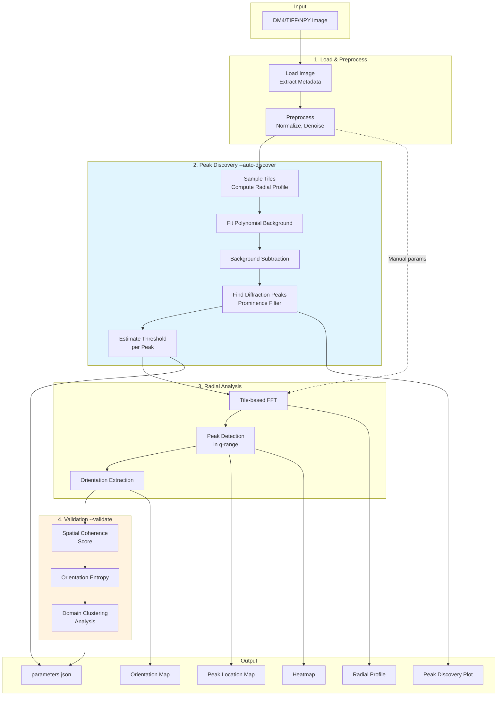
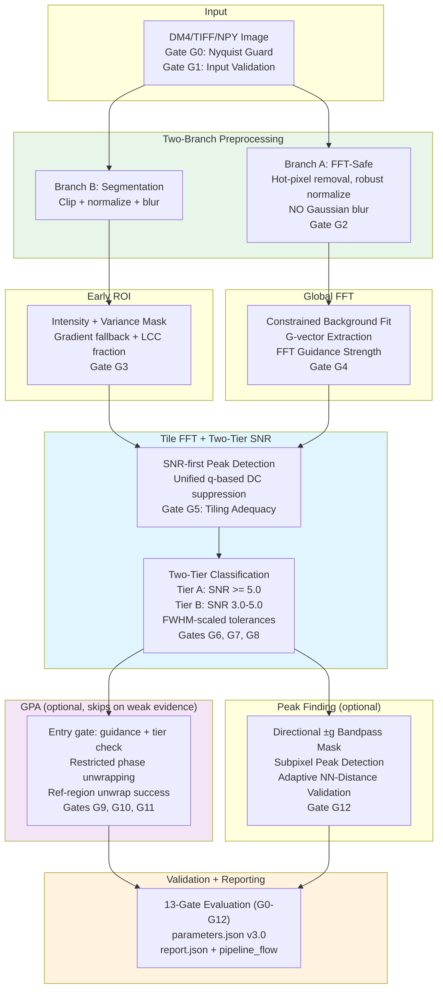
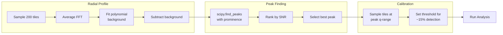

# STEM Domain Analysis

Automated crystal domain segmentation and orientation mapping for STEM-HAADF and EFTEM bright-field (zero-loss filtered) images.

## Overview

This toolkit processes large-scale STEM images to:
- **Detect crystalline domains** via FFT-based radial profile analysis
- **Automatically discover diffraction peaks** without prior material knowledge
- **Map crystal orientations** using diffraction peak localization
- **Extract strain fields** via Geometric Phase Analysis (GPA)
- **Validate results** with a 13-gate quality control system (G0-G12)
- **Generate quantitative metrics** for domain size, shape, and orientation distributions

## Pipeline Architecture

The pipeline supports two modes: the **classic** tile-FFT workflow and the new **hybrid** FFT + GPA + Peak-Finding pipeline activated with `--hybrid`.

### Classic Pipeline



### Hybrid Pipeline (`--hybrid`)



---

## What's New (v3.1) -- EFTEM Bright-Field Upgrade

### Physics-Aware Configuration
- **`PhysicsConfig`** with d-range bounds (`d_min_nm`, `d_max_nm`), imaging mode, and Nyquist safety margin
- **Gate G0 (Nyquist Guard)**: Auto-clamps analysis q-range to 0.95 x q_nyquist when d_min violates sampling theorem; FATAL if entire band is invalid
- New CLI flags: `--physics-d-min`, `--physics-d-max`, `--imaging-mode`

### Robust Background Fitting
- Constrained polynomial background: degree 3 (cap 4) with `q_fit_min` to exclude low-q oscillations
- **FFT guidance strength** classification ("strong"/"weak"/"none") controls downstream GPA eligibility
- Background residual diagnostics: median|res|, MAD, neg-excursion fraction near peaks
- FWHM-scaled antipodal pairing tolerance (was fixed 5% of q)

### Improved Tile Classification
- **SNR-first peak detection** replaces amplitude-percentage thresholds
- Unified q-based DC suppression via `TileFFTConfig.q_dc_min` (single code path)
- `symmetry_score` renamed to `pair_fraction` (with one-cycle deprecation alias)
- FWHM-scaled symmetry tolerance (scales with measured peak width)
- **Orientation confidence** (circular concentration R) per tile -- diagnostic-only

### ROI Robustness
- **Gradient-magnitude fallback** when primary mask fails coverage or LCC check
- **LCC fraction** (largest connected component / total mask) as primary G3 metric
- Full-image ROI forced with `roi_confidence = "low"` when all fallbacks exhausted

### GPA Safety Gates
- GPA skips when FFT guidance is "none" or Tier A fraction < 10%
- Phase unwrapping restricted to amplitude-valid regions (zero before, NaN after)
- **Reference-region unwrap success** metric for G10 (was global metric)
- Mask sigma uses median(FWHM) instead of min (robust to outliers)

### Lattice-Feature Validation
- **Directional ±g angular wedge masks** replace full-ring bandpass (suppresses non-lattice noise)
- **Adaptive NN tolerance** from IQR when >= 10 peaks (tighter for regular lattices)
- `atom_peaks.npy` renamed to `lattice_peaks.npy`

### Expanded Diagnostics
- 7 new diagnostic visualizations: ROI overlay, background residual, reference boundary, tile exemplar FFTs, phase noise histogram, strain outlier map, NN distance histogram
- `parameters.json` includes `derived_cutoffs`, `physics`, `background_diagnostics`, and `pipeline_flow` sections
- Pipeline flow tracking: stages completed, skipped, degraded, with reasons

---

## What's New (v3.0) -- Hybrid Pipeline

### Two-Branch Preprocessing
- **Branch A (FFT-safe)**: Hot-pixel removal + robust normalization with **no Gaussian blur**, preserving FFT peak integrity
- **Branch B (Segmentation)**: Standard preprocessing with Gaussian smooth for ROI mask computation

### Canonical FFT Coordinate System
- All spatial frequencies in **cycles/nm** throughout the pipeline (`d = 1/|g|`, no 2pi)
- `FFTGrid` class handles coordinate conversions, supporting both square and rectangular images

### Two-Tier SNR Classification
- **Tier A (SNR >= 5.0)**: High-confidence tiles used for reference selection, GPA, and clustering
- **Tier B (3.0 <= SNR < 5.0)**: Weak-evidence tiles for visualization and diagnostics only
- Peak-height SNR with annular background that excludes all detected peaks

### Geometric Phase Analysis (GPA)
- **Full-image mode**: Single reference region, global phase/strain extraction
- **Region-wise mode**: Per-domain analysis with automatic stitching
- **Auto-selection**: Deterministic mode choice based on orientation entropy, Tier A coverage, and reference region viability
- Subpixel-correct demodulation via real-space phase ramp
- Phase unwrapping without zero-forcing, with eroded amplitude post-mask

### 13-Gate Quality Control
- Gates G0-G12 covering Nyquist guard, input validation, preprocessing, ROI geometry, FFT viability, tiling adequacy, SNR quality, pair fraction, reference region, phase noise, strain sanity, and lattice consistency
- Four failure behaviors: FATAL, SKIP_STAGE, DEGRADE_CONFIDENCE, FALLBACK

### Peak Finding with Lattice Validation
- Bandpass-filtered image tuned to lattice frequency suppresses thickness gradients
- Adaptive minimum separation derived from expected d-spacing
- Nearest-neighbor lattice validation against expected d-spacing

---

## What's New (v2.0)

### E1: Enhanced Output & Presentation
- **Original image preserved** -- `0_Original.png` saved before any processing
- **Scale bars** on all output images (using matplotlib-scalebar)
- **Smart folder naming** -- Output folder named after input file (`outputs/<filename>/`)

### E2: Interactive Threshold Tuning
- **`--interactive-threshold`** -- Iteratively adjust threshold until satisfied
- Visual feedback with detection rate guidance (too low/high/reasonable)
- Iteration count tracked in `parameters.json`

### E3: Robust Peak Detection
- **`--peak-method percentile95`** (new default) -- Uses mean of top 5% intensities
- More robust for polycrystalline samples with diffuse ring patterns
- Weighted centroid for accurate peak localization
- Legacy mode: `--peak-method max` for single-pixel maximum

### E4: Multi-Plane Discrimination
- **`--multi-plane`** -- Analyze multiple lattice planes simultaneously
- **`--interactive`** -- Select which discovered peaks to analyze
- **`--max-planes N`** -- Limit number of planes (default: 5)
- Color-coded composite maps showing dominant plane per region
- Per-plane orientation maps (`5a_Orientation_Plane0.png`, `5b_...`, etc.)

---

## Features

- **Automatic Peak Discovery** -- Finds crystalline diffraction peaks without requiring d-spacing input
- **Background-Subtracted Radial Profile** -- Reveals true peaks above noise floor
- **Adaptive Threshold Calibration** -- Sets threshold based on actual peak intensity
- **Two-Tier SNR Gating** -- Separates high-confidence from weak-evidence tiles
- **GPA Strain Mapping** -- Full-image or region-wise strain field extraction
- **13-Gate Validation** -- Comprehensive quality control from Nyquist guard to output
- **Spatial Coherence Validation** -- Detects when results are noise vs. real domains
- **Orientation Mapping** -- Color-coded visualization of crystal orientations
- **Domain Metrics** -- Area, perimeter, circularity, orientation statistics
- **DM4 Support** -- Native reading of Gatan Digital Micrograph files
- **Scale Bars** -- Calibrated scale bars on all output images
- **Multi-Plane Analysis** -- Simultaneous analysis of multiple lattice planes

## Installation

### Requirements

- Python 3.10+
- NumPy, SciPy, scikit-image, scikit-learn
- Matplotlib, matplotlib-scalebar
- HyperSpy, ncempy (for DM4 file reading)

### Setup

```bash
# Clone the repository
git clone https://github.com/YishaiRetyk/stem-domain-analysis.git
cd stem-domain-analysis

# Create virtual environment
python -m venv .venv
source .venv/bin/activate  # Linux/Mac
# or: .venv\Scripts\activate  # Windows

# Install dependencies
pip install -r requirements.txt
```

## Quick Start

### Hybrid Pipeline (Recommended for new work)

```bash
# Run the full hybrid pipeline with automatic peak discovery
python analyze.py sample.dm4 --hybrid --auto-discover -o results/

# With GPA strain analysis in full-image mode
python analyze.py sample.dm4 --hybrid --auto-discover --gpa-mode full

# Region-wise GPA for polycrystalline samples
python analyze.py sample.dm4 --hybrid --auto-discover --gpa-mode region

# Skip GPA (FFT analysis + peak finding only)
python analyze.py sample.dm4 --hybrid --auto-discover --no-gpa

# Custom SNR thresholds
python analyze.py sample.dm4 --hybrid --auto-discover --snr-tier-a 4.0 --snr-tier-b 2.5

# EFTEM bright-field with physics constraints
python analyze.py sample.dm4 --hybrid --auto-discover --physics-d-min 0.4 --physics-d-max 1.5 --imaging-mode EFTEM-BF
```

### Classic Auto-Discovery Mode

**Don't know the d-spacing? Use `--auto-discover`:**

```bash
# Auto-discover peaks and validate results
python analyze.py sample.dm4 --auto-discover --validate

# Non-interactive (for scripts/automation)
python analyze.py sample.dm4 --auto-discover --validate --no-interactive -o results/
```

The auto-discovery will:
1. Compute background-subtracted radial profile
2. Find diffraction peaks using prominence detection
3. Recommend optimal d-spacing range and threshold
4. Validate results for spatial coherence

### Manual Mode

If you know the material's d-spacing:

```bash
# Specify parameters directly
python analyze.py sample.dm4 \
    --d-min 0.39 \
    --d-max 0.43 \
    --threshold 45000 \
    -o results/

# Interactive mode - prompts for missing parameters
python analyze.py sample.dm4
```

### Full CLI Reference

```bash
python analyze.py <input> [options]

Positional:
  input                   Input file (DM4, DM3, TIFF, or NPY)

Core Options:
  -o, --output DIR        Output directory (default: outputs/<input_filename>/)
  --pixel-size FLOAT      Pixel size in nm/pixel (auto-detected from DM4)
  --d-min FLOAT           Minimum d-spacing in nm
  --d-max FLOAT           Maximum d-spacing in nm
  --threshold FLOAT       Peak detection intensity threshold
  --tile-size INT         FFT tile size in pixels (default: 256)
  --stride INT            Tile stride in pixels (default: tile_size/2)
  --auto-discover         Automatically discover diffraction peaks
  --validate              Validate results with coherence analysis
  --no-interactive        Fail instead of prompting for missing params
  --save-preprocessed     Save preprocessed image as NPY
  -v, --verbose           Verbose output
  --help                  Show all available options

Hybrid Pipeline:
  --hybrid                Run the hybrid FFT + GPA + Peak-Finding pipeline
  --config PATH           YAML config file for hybrid pipeline parameters
  --gpa-mode {auto,full,region}
                          GPA execution mode (default: auto)
  --gpa-on-fail {fallback_to_region,skip,error}
                          GPA failure behavior (default: fallback_to_region)
  --snr-tier-a FLOAT      Tier A SNR threshold (default: 5.0)
  --snr-tier-b FLOAT      Tier B SNR threshold (default: 3.0)
  --no-gpa                Skip GPA stage entirely
  --no-peak-finding       Skip peak-finding stage
  --report-format {json,html,both}
                          Report output format (default: json)

Physics & EFTEM:
  --physics-d-min FLOAT   Expected minimum d-spacing in nm (default: 0.4)
  --physics-d-max FLOAT   Expected maximum d-spacing in nm (default: 1.5)
  --imaging-mode STR      Imaging mode label (default: EFTEM-BF)

Peak Detection (E3):
  --peak-method {max,percentile95}
                          Peak intensity method (default: percentile95)
                          - max: Single brightest pixel
                          - percentile95: Mean of top 5% (more robust)

Interactive Threshold (E2):
  --interactive-threshold
                          Enable iterative threshold adjustment
                          Shows results, allows tweaking until satisfied

Multi-Plane Analysis (E4):
  --multi-plane           Analyze all discovered peaks simultaneously
                          (requires --auto-discover)
  --interactive           Interactive mode: select which peaks to analyze
  --max-planes N          Maximum planes to analyze (default: 5)
```

### Getting Help

```bash
# Show all available options
python analyze.py --help
```

### Usage Examples

```bash
# Hybrid pipeline (recommended)
python analyze.py sample.dm4 --hybrid --auto-discover

# Hybrid with GPA strain analysis
python analyze.py sample.dm4 --hybrid --auto-discover --gpa-mode auto

# Classic auto-discovery
python analyze.py sample.dm4 --auto-discover

# With interactive threshold tuning
python analyze.py sample.dm4 --auto-discover --interactive-threshold

# Multi-plane analysis (all discovered peaks)
python analyze.py sample.dm4 --auto-discover --multi-plane

# Interactive plane selection
python analyze.py sample.dm4 --auto-discover --multi-plane --interactive

# Non-interactive batch mode
python analyze.py *.dm4 --hybrid --auto-discover --no-interactive
```

## Output Files

Output is saved to `outputs/<input_filename>/` by default.

### Classic Pipeline Outputs

| File | Description |
|------|-------------|
| `0_Original.png` | Original image before processing (with scale bar) |
| `original.npy` | Original image data (NumPy format) |
| `1_Peak_Discovery.png` | Background-subtracted radial profile with detected peaks *(auto-discover only)* |
| `2_Radial_Profile.png` | FFT radial intensity profile with highlighted q-range |
| `3_FFT_Power_Spectrum.png` | 2D FFT power spectrum visualization |
| `4_Peak_Location_Map.png` | Spatial map of detected crystalline peaks (green overlay, with scale bar) |
| `5_Orientation_Map.png` | Color-coded crystal orientation map (-180 to +180 degrees, with scale bar) |
| `5a_Orientation_Plane0.png` | Per-plane orientation map *(multi-plane mode only)* |
| `6_Multi_Plane_Composite.png` | Color-coded composite showing dominant plane per region *(multi-plane mode only)* |
| `Heatmap.png` | Peak intensity heatmap across tile grid |
| `parameters.json` | All analysis parameters, validation results, and plane metadata |

### Hybrid Pipeline Outputs (`--hybrid`)

| File | Description |
|------|-------------|
| `parameters.json` | v3.0 schema with FFT convention, tier summary, GPA decision, all gate results |
| `report.json` | Gate results and diagnostics |
| `global_g_vectors.json` | Extracted g-vectors with per-vector SNR, FWHM, angle, d-spacing |
| `tier_map.npy` | Tile classification map (0=skip, 1=rejected, 2=Tier B, 3=Tier A) |
| `gpa_mode_decision.json` | GPA mode selection metrics and confidence *(when GPA enabled)* |
| `gpa_reference.json` | Reference region details *(when GPA enabled)* |
| `lattice_peaks.npy` | Subpixel lattice-feature positions (N x 5: x, y, intensity, sigma_x, sigma_y) *(when peak-finding enabled)* |
| `peak_stats.json` | NN-distance statistics and lattice validation *(when peak-finding enabled)* |

## How Auto-Discovery Works

The `--auto-discover` flag enables automatic parameter selection:



### Why Background Subtraction?

Raw FFT profiles show a strong power-law decay that masks diffraction peaks:

| Without Background Subtraction | With Background Subtraction |
|-------------------------------|----------------------------|
| Monotonic decay | Clear peaks visible |
| Peaks hidden in noise | SNR quantifiable |
| Manual d-spacing required | Automatic peak finding |

## Quality Gates (Hybrid Pipeline)

The hybrid pipeline evaluates 13 quality gates (G0-G12) at each stage:

| Gate | Metric | Default Threshold | On Failure |
|------|--------|-------------------|------------|
| **G0** | Nyquist guard (d_min vs sampling) | q_max < 0.95 × q_nyquist | DEGRADE (auto-clamp) / FATAL |
| **G1** | Input validity (2D, no NaN, >=512x512) | pass/fail | FATAL |
| **G2** | Preprocessing quality (clipped fraction, range ratio) | <0.5%, >10 | DEGRADE_CONFIDENCE |
| **G3** | ROI geometry (coverage, LCC fraction, fragments) | 10-95%, LCC>=0.5, <=20 | FALLBACK |
| **G4** | Global FFT viability (best peak SNR) | >=3.0 | FALLBACK |
| **G5** | Tiling adequacy (periods per tile, d-aware) | >=20 | FATAL |
| **G6** | Tier A detection rate | >=5% of ROI tiles | DEGRADE_CONFIDENCE |
| **G7** | Tier A SNR quality (median) | >=5.0 | DEGRADE_CONFIDENCE |
| **G8** | Pair fraction quality (mean score) | >=0.3 | DEGRADE_CONFIDENCE |
| **G9** | Reference region quality | area>=9, entropy<=0.3, SNR>=5.0 | SKIP_STAGE |
| **G10** | GPA phase noise + ref-region unwrap | sigma<=0.3 rad, ref unwrap>=70% | SKIP_STAGE |
| **G11** | GPA strain sanity | ref strain<=0.005, outliers<=20% | SKIP_STAGE |
| **G12** | Peak lattice consistency | >=50% valid NN distances | DEGRADE_CONFIDENCE |

**Failure behaviors:**
- **FATAL**: Pipeline halts immediately
- **SKIP_STAGE**: Stage skipped, downstream stages that depend on it also skipped
- **DEGRADE_CONFIDENCE**: Output marked as degraded, pipeline continues
- **FALLBACK**: Use fallback path (e.g., full-image mask, user-specified d-ranges)

## Validation Metrics (Classic Pipeline)

When using `--validate`, the tool computes:

| Metric | Good Value | Meaning |
|--------|------------|---------|
| **Coherence Score** | > 0.5 | Combined spatial + orientation coherence |
| **Local Coherence** | > 0.5 | Neighboring tiles have similar orientations |
| **Orientation Entropy** | < 0.5 | Orientations cluster (not random) |
| **Detection Rate** | 5-30% | Reasonable crystalline fraction |

### Interpreting Results

| Interpretation | What It Means | Action |
|----------------|---------------|--------|
| `good_domains` | Real crystalline domains detected | Results valid |
| `weak_domains` | Some structure, possibly noisy | Consider adjusting threshold |
| `likely_noise_high_detection` | Too many detections, random orientations | Wrong q-range or threshold too low |
| `sparse_or_noise` | Very few detections | Threshold too high or no crystallinity |

## Parameters Reference

### FFT Convention

All spatial frequencies are in **cycles/nm** (not radians/nm). The d-spacing relation is `d = 1/|g|` with no 2pi factor.

```
q (cycles/nm) = 1 / d (nm)
q_scale = 1 / (N * pixel_size_nm)    cycles/nm per FFT pixel
```

| Material Type | d-spacing (nm) | q (cycles/nm) |
|--------------|----------------|---------------|
| Metals | 0.2 - 0.4 | 2.5 - 5.0 |
| Oxides | 0.3 - 0.6 | 1.7 - 3.3 |
| Organics | 0.5 - 1.5 | 0.7 - 2.0 |
| Proteins | 1.0 - 5.0 | 0.2 - 1.0 |

### Radial Analysis

| Parameter | Default | Description |
|-----------|---------|-------------|
| `q_range` | Auto or `(2.3, 2.6)` | Target q-range in cycles/nm |
| `intensity_threshold` | Auto or `45000` | Minimum peak intensity |
| `tile_size` | `256` | FFT window size in pixels |
| `stride` | `128` | Step between tiles |
| `window` | `hann` | Windowing function for FFT |

### Hybrid Pipeline Parameters

| Parameter | Default | Description |
|-----------|---------|-------------|
| `physics.d_min_nm` | 0.4 | Expected minimum d-spacing (nm) |
| `physics.d_max_nm` | 1.5 | Expected maximum d-spacing (nm) |
| `physics.imaging_mode` | EFTEM-BF | Imaging mode label |
| `physics.nyquist_safety_margin` | 0.95 | Clamp q_max to this fraction of q_nyquist |
| `tier_a_snr` | 5.0 | High-confidence SNR threshold |
| `tier_b_snr` | 3.0 | Weak-evidence SNR threshold |
| `tile_fft.q_dc_min` | 0.25 | DC suppression cutoff (cycles/nm) |
| `tile_fft.peak_snr_threshold` | 2.5 | SNR-first tile peak detection threshold |
| `global_fft.q_fit_min` | 0.30 | Background fit low-q exclusion (cycles/nm) |
| `global_fft.background_default_degree` | 3 | Polynomial degree (max 4) |
| `gpa.mode` | auto | GPA mode: auto, full, or region |
| `gpa.displacement_smooth_sigma` | 2.0 px | Gaussian smoothing before strain gradients |
| `gpa.amplitude_threshold` | 0.1 | Fraction of max amplitude for phase mask |
| `gpa.max_phase_noise` | 0.3 rad | G10 phase noise threshold |
| `peak_finding.min_separation_factor` | 0.6 | min_sep = factor * d_expected_px |
| `peak_finding.bandpass_bandwidth` | 0.3 | Bandwidth as fraction of \|g_dom\| |
| `peak_finding.angular_width_deg` | 30.0 | Half-width of directional wedge mask |
| `roi.min_lcc_fraction` | 0.5 | LCC fraction threshold for G3 |

## Python API

### Classic Pipeline

```python
from src.io_dm4 import load_dm4
from src.preprocess import preprocess
from src.peak_discovery import discover_peaks, get_recommended_params
from src.radial_analysis import run_radial_analysis

# Load and preprocess
record = load_dm4('sample.dm4')
processed = preprocess(record.image)

# Auto-discover peaks
discovery = discover_peaks(
    processed,
    record.pixel_size_nm,
    tile_size=256,
    verbose=True
)

# Get recommended parameters
params = get_recommended_params(discovery)
if params:
    print(f"Recommended d-spacing: {params['d_min']:.3f} - {params['d_max']:.3f} nm")
    print(f"Recommended threshold: {params['intensity_threshold']:.0f}")

# Run analysis with discovered parameters
results = run_radial_analysis(
    processed,
    pixel_size_nm=record.pixel_size_nm,
    output_dir='outputs',
    params={
        'q_range': (params['q_min'], params['q_max']),
        'intensity_threshold': params['intensity_threshold'],
    },
    verbose=True
)
```

### Hybrid Pipeline

```python
from src.fft_coords import FFTGrid
from src.pipeline_config import PipelineConfig
from src.preprocess_fft_safe import preprocess_fft_safe
from src.preprocess_segmentation import preprocess_segmentation
from src.roi_masking import compute_roi_mask, downsample_to_tile_grid
from src.global_fft import compute_global_fft
from src.tile_fft import process_all_tiles
from src.fft_snr_metrics import build_gated_tile_grid
from src.gpa import run_gpa
from src.peak_finding import build_bandpass_image, find_subpixel_peaks, validate_peak_lattice
from src.validation import validate_pipeline
from src.reporting import save_pipeline_artifacts

# Configure
config = PipelineConfig(pixel_size_nm=0.1297)
fft_grid = FFTGrid(height, width, config.pixel_size_nm)

# Branch A: FFT-safe preprocessing (no blur)
preproc = preprocess_fft_safe(image, config.preprocessing)

# Branch B: Segmentation preprocessing
seg = preprocess_segmentation(image, config.segmentation)

# Early ROI mask
roi = compute_roi_mask(seg.image_seg, config.roi)
roi_grid = downsample_to_tile_grid(roi.mask_full, config.tile_size, config.stride)

# Global FFT: radial profile, g-vector extraction
global_result = compute_global_fft(preproc.image_fft, fft_grid, config.global_fft)

# Tile FFT with two-tier SNR classification
peak_sets, skipped = process_all_tiles(
    preproc.image_fft, roi_grid, fft_grid,
    tile_size=config.tile_size, stride=config.stride,
)
tile_grid = FFTGrid(config.tile_size, config.tile_size, config.pixel_size_nm)
gated = build_gated_tile_grid(peak_sets, skipped, tile_grid, config.tile_size)

# Validation
report = validate_pipeline(
    preproc_record=preproc, roi_result=roi,
    global_fft_result=global_result, gated_grid=gated,
)

# Save all artifacts
save_pipeline_artifacts(output_dir, config=config, fft_grid=fft_grid,
                        preproc_record=preproc, validation_report=report, ...)
```

## Module Reference

### Hybrid Pipeline Modules

| Module | Purpose |
|--------|---------|
| `src/fft_coords.py` | Canonical FFT coordinate system (`FFTGrid` class) |
| `src/pipeline_config.py` | All parameter dataclasses, config classes, and defaults |
| `src/gates.py` | Gate registry G1-G12 with thresholds and failure behaviors |
| `src/preprocess_fft_safe.py` | Branch A: hot-pixel removal + robust normalize, no blur |
| `src/preprocess_segmentation.py` | Branch B: clip + normalize + Gaussian smooth |
| `src/roi_masking.py` | Early ROI mask (intensity + variance, geometric gates) |
| `src/global_fft.py` | Full-image FFT, radial profile, g-vector extraction |
| `src/tile_fft.py` | Tile-based FFT with ROI-aware processing |
| `src/fft_peak_detection.py` | Per-peak SNR, FWHM, symmetry, two-tier classification |
| `src/fft_snr_metrics.py` | Aggregate SNR/symmetry/FWHM maps, tier classification |
| `src/reference_selection.py` | GPA reference region selection (Tier A tiles only) |
| `src/gpa.py` | GPA engine: full-image and region-wise modes, strain fields |
| `src/peak_finding.py` | Subpixel peak detection with lattice validation |
| `src/validation.py` | Unified 13-gate evaluation (G0-G12) and `ValidationReport` |
| `src/reporting.py` | JSON/artifact output, parameters.json v3.0 |
| `src/hybrid_viz.py` | PNG visualization orchestrator (24 artifacts) |

### Legacy Modules

| Module | Purpose |
|--------|---------|
| `src/io_dm4.py` | DM4/DM3 file loading with metadata extraction |
| `src/preprocess.py` | Image normalization, denoising, background subtraction |
| `src/peak_discovery.py` | Automatic peak finding and threshold calibration |
| `src/radial_analysis.py` | FFT analysis, peak detection, orientation mapping |
| `src/fft_features.py` | Feature extraction for ML pipelines |
| `src/cluster_domains.py` | HDBSCAN clustering and spatial regularization |
| `src/domain_metrics.py` | Per-domain statistics and quality gates |
| `src/viz.py` | Visualization utilities |
| `src/ilastik_roi.py` | ROI export for Ilastik workflows |

## Example Workflow

```bash
# 1. First run: hybrid pipeline with auto-discovery
python analyze.py myimage.dm4 --hybrid --auto-discover -o test_run/

# 2. Review parameters.json for gate results and tier summary
# 3. Check report.json for detailed diagnostics

# 4. If GPA strain maps are needed:
python analyze.py myimage.dm4 --hybrid --auto-discover --gpa-mode full -o strain_run/

# 5. For batch processing:
python analyze.py *.dm4 --hybrid --auto-discover --no-interactive --no-gpa
```

## Troubleshooting

### "No significant peaks found"
- Image may be amorphous (no crystalline regions)
- Try preprocessing with different parameters
- Check if pixel size is correct

### High detection rate with random orientations
- Threshold too low -- increase `--threshold`
- Wrong q-range -- check material's expected d-spacing
- Use `--auto-discover` to find correct parameters

### Low detection rate
- Threshold too high -- decrease `--threshold`
- Peaks may be at different q-range
- Sample may have weak crystallinity

### Hybrid pipeline: G2 gate fails (degraded confidence)
- Image has extreme clipping or very narrow dynamic range
- Pipeline continues with min-max normalization fallback
- Check `parameters.json` for `preprocessing.confidence` field

### Hybrid pipeline: GPA stage skipped
- Reference region too small (G9) or phase noise too high (G10)
- Try `--gpa-mode region` for polycrystalline samples
- Check `gpa_mode_decision.json` for decision metrics

## Citation

```bibtex
@software{stem_domain_analysis,
  title={STEM Domain Analysis},
  author={Yishai Retyk},
  year={2025},
  url={https://github.com/YishaiRetyk/stem-domain-analysis}
}
```

## License

MIT License - see [LICENSE](LICENSE) for details.

## Contributing

Contributions welcome! Please open an issue or submit a pull request.
